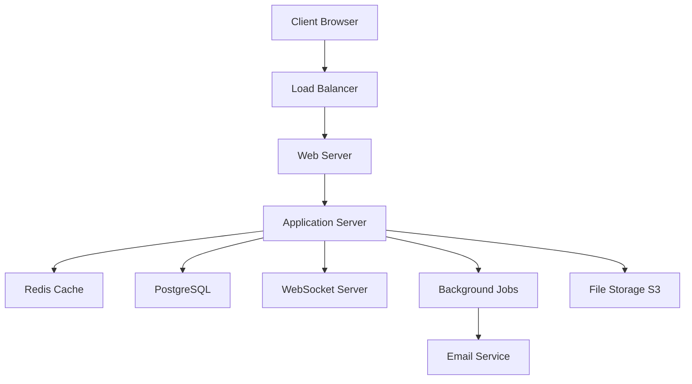

# Modern Web Application

A comprehensive full-stack web application built with modern technologies, featuring real-time capabilities, robust authentication, and scalable architecture.

## 🚀 Features

### Core Functionality
- **Real-time Updates** - WebSocket-powered live data synchronization
- **User Management** - Complete CRUD operations with role-based access
- **Analytics Dashboard** - Interactive charts and performance metrics  
- **File Upload & Storage** - AWS S3 integration with CDN support
- **Email Notifications** - Transactional emails with templates
- **API Rate Limiting** - Protection against abuse with configurable limits

### Security & Authentication
- **JWT Authentication** - Secure token-based auth with refresh tokens
- **OAuth Integration** - Google & GitHub social login support
- **Password Security** - bcrypt hashing with configurable rounds
- **CSRF Protection** - Cross-site request forgery prevention
- **Input Validation** - Comprehensive data sanitization
- **Security Headers** - Helmet.js security middleware

### Performance & Scalability
- **Redis Caching** - Multi-layer caching strategy for optimal performance
- **Database Optimization** - Connection pooling and query optimization
- **CDN Integration** - CloudFront for global content delivery
- **Compression** - Gzip/Brotli compression for faster loading
- **Health Monitoring** - Automated health checks and alerts

## 🏗️ Architecture



## 🛠️ Technology Stack

### Backend
- **Runtime**: Node.js / Rust / Go (polyglot architecture)
- **Web Framework**: Express.js / Axum / Gorilla Mux
- **Database**: PostgreSQL with GORM/Prisma ORM
- **Cache**: Redis for session storage and caching
- **Queue**: Bull/Sidekiq for background job processing

### Frontend
- **Framework**: React 18 with TypeScript
- **State Management**: Redux Toolkit / Zustand
- **UI Components**: Custom design system with Tailwind CSS
- **Charts**: Chart.js / D3.js for data visualization
- **Real-time**: Socket.IO client for WebSocket connections

### DevOps & Infrastructure
- **Containerization**: Docker & Docker Compose
- **Orchestration**: Kubernetes with Helm charts
- **CI/CD**: GitHub Actions with automated testing
- **Monitoring**: Prometheus, Grafana, Sentry
- **Logging**: ELK Stack (Elasticsearch, Logstash, Kibana)

## 📋 Prerequisites

Before running this application, ensure you have:

- **Node.js** >= 18.0.0 or **Go** >= 1.20 or **Rust** >= 1.70
- **PostgreSQL** >= 13.0
- **Redis** >= 6.0
- **Docker** & **Docker Compose** (for containerized deployment)

## 🚀 Quick Start

### 1. Clone the Repository
```bash
git clone https://github.com/company/modern-web-app.git
cd modern-web-app
```

### 2. Environment Setup
```bash
# Copy environment template
cp .env.example .env

# Edit environment variables
nano .env
```

### 3. Database Setup
```bash
# Start PostgreSQL and Redis
docker-compose up -d postgres redis

# Run database migrations
npm run migrate
# or
go run cmd/migrate/main.go
# or  
cargo run --bin migrate
```

### 4. Install Dependencies & Start

#### Node.js Version
```bash
npm install
npm run dev
```

#### Go Version
```bash
go mod download
go run cmd/server/main.go
```

#### Rust Version
```bash
cargo build --release
cargo run --release
```

## 📁 Project Structure

```
├── src/                    # Source code
│   ├── components/         # Reusable UI components
│   ├── pages/             # Application pages/routes
│   ├── hooks/             # Custom React hooks
│   ├── utils/             # Utility functions
│   └── types/             # TypeScript type definitions
├── server/                # Backend application
│   ├── routes/            # API route handlers
│   ├── middleware/        # Custom middleware
│   ├── models/            # Database models
│   ├── services/          # Business logic layer
│   └── utils/             # Server utilities
├── public/                # Static assets
├── migrations/            # Database migrations
├── tests/                 # Test suites
├── docs/                  # Documentation
├── docker/                # Docker configurations
└── k8s/                   # Kubernetes manifests
```

## 🔧 Configuration

The application uses a hierarchical configuration system:

1. **Environment Variables** - Runtime configuration
2. **config.json** - Application defaults
3. **docker-compose.yml** - Container orchestration
4. **k8s/** - Kubernetes deployment configs

### Key Configuration Files

- `config/database.json` - Database connection settings
- `config/redis.json` - Cache configuration  
- `config/email.json` - Email service setup
- `config/auth.json` - Authentication providers

## 🧪 Testing

### Running Tests
```bash
# Run all tests
npm test

# Run with coverage
npm run test:coverage

# Run specific test suite
npm run test:unit
npm run test:integration
npm run test:e2e
```

### Test Structure
- **Unit Tests** - Individual component/function testing
- **Integration Tests** - API endpoint testing
- **E2E Tests** - Full application workflow testing
- **Load Tests** - Performance and stress testing

## 🚀 Deployment

### Docker Deployment
```bash
# Build and start all services
docker-compose up --build

# Production deployment
docker-compose -f docker-compose.prod.yml up -d
```

### Kubernetes Deployment
```bash
# Apply Kubernetes manifests
kubectl apply -f k8s/

# Check deployment status
kubectl get pods -n webapp
```

### CI/CD Pipeline

The project includes automated CI/CD with GitHub Actions:

1. **Code Quality** - ESLint, Prettier, TypeScript checks
2. **Testing** - Unit, integration, and E2E tests
3. **Security** - Dependency vulnerability scanning
4. **Build** - Docker image creation and registry push
5. **Deploy** - Automated deployment to staging/production

## 📊 Monitoring & Observability

### Application Metrics
- **Response Time** - API endpoint performance
- **Throughput** - Requests per second
- **Error Rates** - 4xx/5xx response tracking
- **Database Performance** - Query execution times

### Health Checks
```bash
# Application health
curl http://localhost:8080/health

# Database connectivity
curl http://localhost:8080/health/db

# Redis connectivity  
curl http://localhost:8080/health/cache
```

### Logs
```bash
# View application logs
docker-compose logs -f app

# Search logs in Elasticsearch
curl -X GET "elasticsearch:9200/webapp-logs/_search?q=error"
```

## 🤝 Contributing

We welcome contributions! Please see our [Contributing Guide](CONTRIBUTING.md) for details.

### Development Workflow
1. Fork the repository
2. Create a feature branch (`git checkout -b feature/amazing-feature`)
3. Commit changes (`git commit -m 'Add amazing feature'`)
4. Push to branch (`git push origin feature/amazing-feature`)
5. Open a Pull Request

### Code Standards
- **TypeScript** - Strict mode enabled
- **ESLint** - Airbnb configuration with custom rules
- **Prettier** - Consistent code formatting
- **Conventional Commits** - Semantic commit messages

## 📄 API Documentation

Interactive API documentation is available at:
- **Swagger UI**: `http://localhost:8080/api-docs`
- **Redoc**: `http://localhost:8080/redoc`
- **Postman Collection**: [Download here](docs/postman-collection.json)

### Authentication
```bash
# Login and get JWT token
curl -X POST http://localhost:8080/api/auth/login \
  -H "Content-Type: application/json" \
  -d '{"email": "user@example.com", "password": "password"}'

# Use token in subsequent requests
curl -X GET http://localhost:8080/api/users \
  -H "Authorization: Bearer YOUR_JWT_TOKEN"
```

## 📈 Performance Benchmarks

| Metric | Target | Current |
|--------|--------|---------|
| Response Time (p95) | < 200ms | 150ms |
| Throughput | > 1000 RPS | 1200 RPS |
| Error Rate | < 0.1% | 0.05% |
| Uptime | > 99.9% | 99.95% |

## 🐛 Troubleshooting

### Common Issues

**Database Connection Errors**
```bash
# Check PostgreSQL status
docker-compose ps postgres
docker-compose logs postgres
```

**Redis Connection Issues**  
```bash
# Verify Redis connectivity
redis-cli ping
```

**Port Already in Use**
```bash
# Find and kill process using port
lsof -ti:8080 | xargs kill -9
```

## 📚 Additional Resources

- [Architecture Decision Records (ADRs)](docs/adr/)
- [Database Schema Documentation](docs/database.md)
- [API Rate Limiting Guide](docs/rate-limiting.md)
- [Deployment Runbook](docs/deployment.md)
- [Performance Tuning Guide](docs/performance.md)

## 📞 Support

- **Documentation**: [Wiki](https://github.com/company/modern-web-app/wiki)
- **Issues**: [GitHub Issues](https://github.com/company/modern-web-app/issues)
- **Discussions**: [GitHub Discussions](https://github.com/company/modern-web-app/discussions)
- **Email**: dev-support@company.com

## 📝 License

This project is licensed under the MIT License - see the [LICENSE](LICENSE) file for details.

## 🙏 Acknowledgments

- Thanks to all [contributors](CONTRIBUTORS.md)
- Built with ❤️ by the Development Team
- Special thanks to the open-source community

---

**⭐ Star this repository if you find it helpful!**